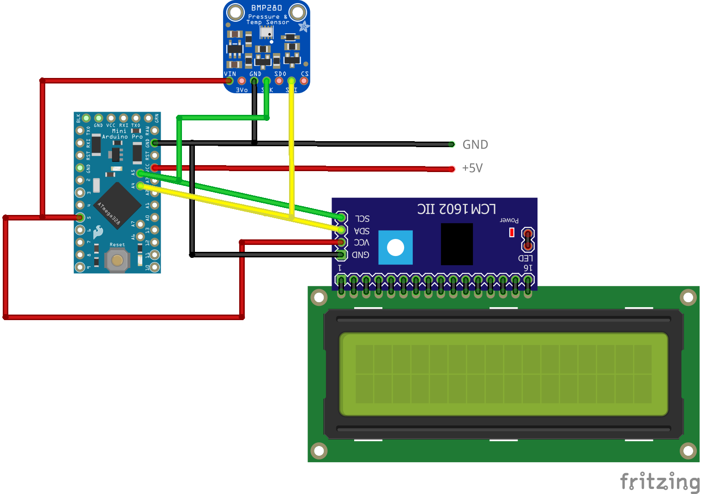
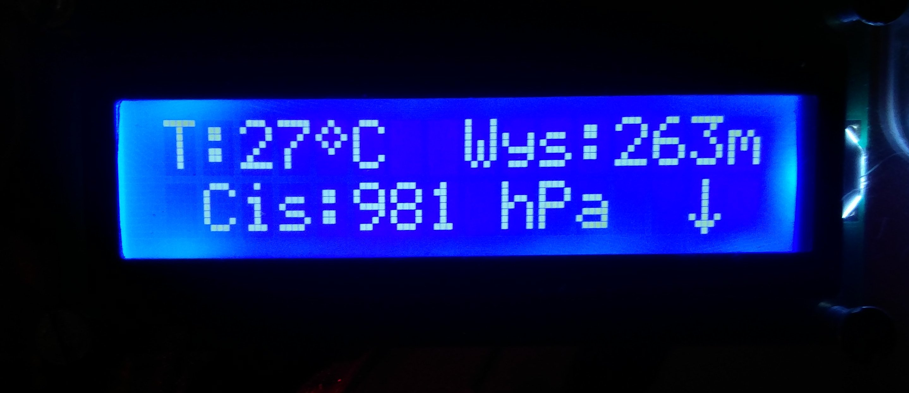

# Barometer

## Links:
* Adafruit_BMP280_Library: https://github.com/adafruit/Adafruit_BMP280_Library
* Adafruit_Sensor-master:https://github.com/pkourany/Adafruit_Unified_Sensor_Library/tree/master/Adafruit_Sensor-master
* LiquidCrystal-I2C: https://github.com/fdebrabander/Arduino-LiquidCrystal-I2C-library

## Schematic:

## Example display:
